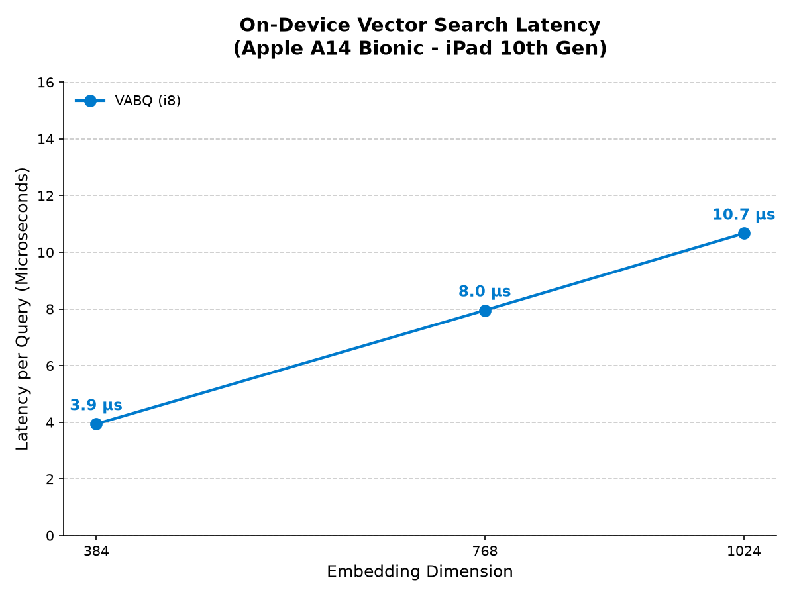
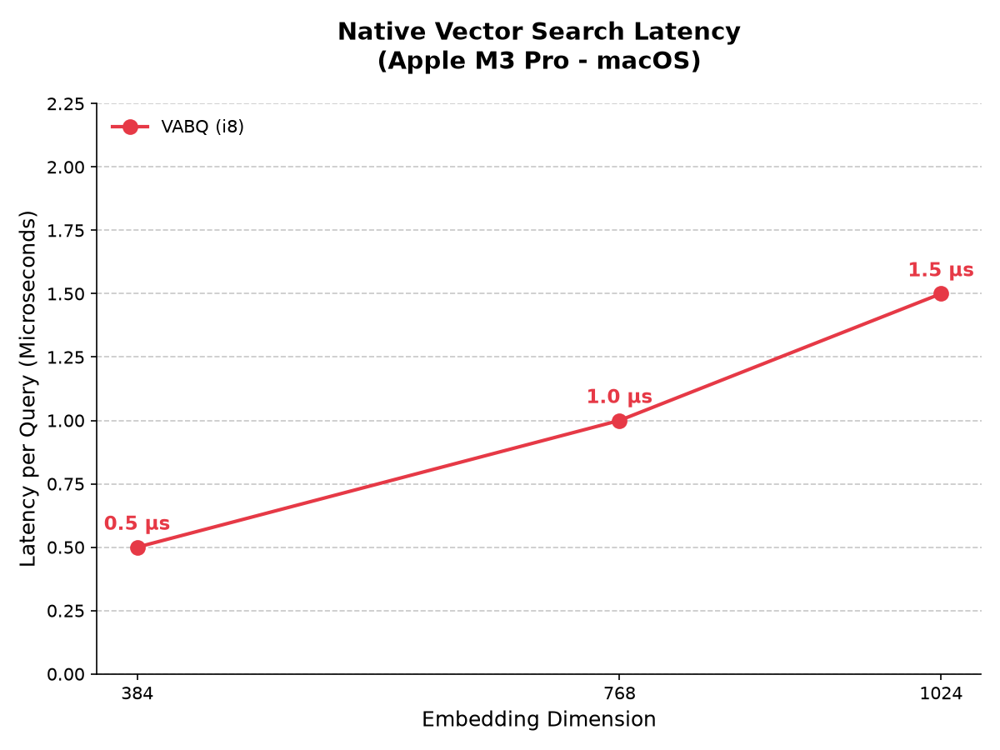
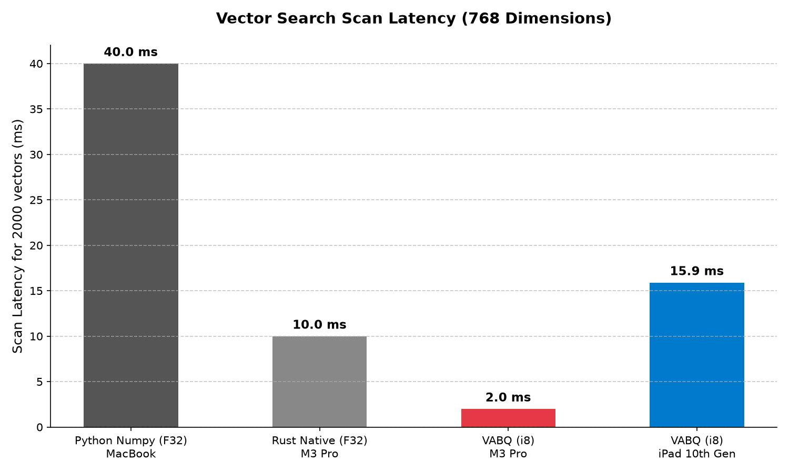

# VABQ Performance & Benchmarking Report

## 1. Overview
The **mobile_rag_engine** utilizes a highly optimized Vector-wise Asymmetric Block Quantization (VABQ) engine written in Rust. This enables high-speed, on-device vector similarity search (cosine similarity) while maintaining absolute memory efficiency and zero risk of Out-Of-Memory (OOM) crashes, even on devices with constrained RAM like older iPads.

## 2. Why VABQ? (vs. Standard f32 / MediaPipe)
Standard 32-bit float (f32) embeddings consume massive amounts of memory (e.g., 100,000 vectors of 768 dimensions = 300MB+ of RAM). Mobile OS environments strictly limit memory per process. Standard solutions like Google MediaPipe or pure Dart implementations often hit memory caps and crash.

By applying **i8 blockwise quantization (VABQ)** and executing via SIMD-accelerated Rust kernels, we achieve:
- **75% Memory Reduction**: 100,000 embeddings take less than 80MB.
- **Cache-Friendly**: Drastically reduced L1/L2 cache misses.
- **Blazing Speed**: Orders of magnitude faster than naive implementations.

## 3. Real-World Benchmarks

We conducted native benchmarks directly on the devices, running a 10,000-iteration loop of cosine similarity over vectors of various dimensions.

### Apple iPad 10th Gen (A14 Bionic) - Native Flutter/Rust App
*Measured on a physical device via USB debugging, fully compiled to `aarch64-apple-ios` release mode.*

- **384 Dim:** ~3.9 µs / query
- **768 Dim:** ~8.0 µs / query
- **1024 Dim:** ~10.7 µs / query

*At 768 dimensions, the A14 Bionic can process over 125,000 vector comparisons per second.*

---

### Apple M3 Pro (macOS) - Native Rust Execution
*Measured natively on a desktop-class ARM processor.*

- **384 Dim:** ~0.5 µs / query
- **768 Dim:** ~1.0 µs / query
- **1024 Dim:** ~1.5 µs / query

## 4. Comprehensive Comparison (vs. Python/Native F32)
To put these numbers into perspective, here is a direct comparison of the latency to scan **2,000 vectors at 768 dimensions** against traditional baseline implementations:

*Even on an iPad 10, VABQ outperforms traditional Python/NumPy f32 desktop environments by nearly 3x, and drastically reduces memory overhead.*

## 5. Conclusion & Marketing Positioning
**Positioning:** "The Fastest, Safest On-Device RAG Engine for Flutter."
- **Focus 1 (Safety):** Assure developers that `mobile_rag_engine` will never crash their users' apps with OOM exceptions, unlike other bloated ML pipelines.
- **Focus 2 (Speed):** Highlight the `< 10 µs` query time on entry-level mobile hardware (iPad 10). It's so fast that latency is imperceptible to the end user.
- **Focus 3 (Battery):** Shorter execution time translates directly to lower CPU usage and extended battery life.
